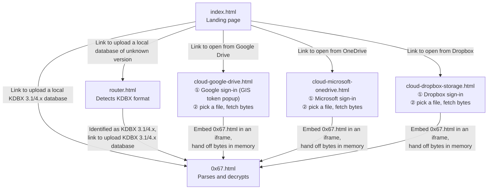

# Pages

This document maps `pages/` — what each page does and how a visitor moves between them.

## Page inventory

| Page | Availability | Description |
|---|---|---|
| `index.html` | GA | Landing page. The entry point; links to every other page. |
| `router.html` | GA | Detects a database's KDBX format and provides a link to the matching app page. |
| `0x67.html` | GA | The app — parses, decrypts, and edits KDBX 3.1 and 4.x databases. |
| `cloud-google-drive.html` | GA | Connector for Google Drive. |
| `cloud-microsoft-onedrive.html` | Future | Connector for OneDrive. |
| `cloud-dropbox-storage.html` | Future | Connector for Dropbox. |

## User flow

## How the Google Drive connector works

`cloud-google-drive.html` never parses or decrypts anything itself. It signs in to Google, lets the user pick a `.kdbx` file with the Google Picker, downloads its bytes, then embeds the real `0x67.html` app in an iframe and hands it those bytes. All the unlocking, browsing, and editing is the ordinary, unmodified app; the connector only fetches the file and writes it back.

**Sign-in.** The connector loads Google's own [Identity Services][gis-token] library to obtain an access token in the browser via a popup. A popup is used rather than a redirect because a redirect would require keeping state across the navigation, which the no-persistence rule forbids; the cost is that a browser blocking the popup (e.g. a locked-down kiosk) needs popups allowed for this site. File selection then uses the [Google Picker][picker] with the non-sensitive `drive.file` scope, so the app only reaches the files the user picks. These two Google libraries are the connector's only external code, and no state is stored anywhere (see [Trust][trust] / `AGENTS.md`): the master password and all decryption stay in the sandboxed `0x67.html` iframe, which loads nothing external.

**Handoff and save.** The connector and the embedded app exchange same-origin messages: the connector hands the app the file's bytes, and on save the app hands the edited bytes back for the connector to write to Drive. The local-download option is hidden while embedded. Opened on its own, `0x67.html` receives no such messages and behaves exactly as it does standalone.

## Local storage

Opening a database from local disk needs nothing but the file itself: no account, no sign-in, no network connection. `router.html` and `0x67.html` work completely offline, so a vault on a USB drive or a personal laptop opens the same way whether there's an internet connection or not. Nothing about the file goes anywhere — there's no vendor, no OAuth exchange, and no service to trust beyond the browser itself. Opening a local file needs no account of any kind and is open to every visitor.

## Cloud storage providers

Anyone can open and save a database directly from Google Drive and other cloud storage providers (as demand drives adoption), without ever downloading it to disk. The file's bytes go straight into browser memory, get edited there, and are written straight back to the provider; on-disk storage is never part of the round trip. That's more convenient than the download-edit-reupload cycle a local file requires, and it's more secure. On a computer whose disk can't be accessed, trusted, or written to like a public library terminal, a locked-down kiosk, a borrowed laptop, there's nothing on that disk to worry about, because the vault was never on it.

The cloud connectors are open to every visitor: there is no sponsorship gate, and opening a cloud vault requires only your own provider's sign-in and the master password — never a GitHub login. KeePass Web provides no storage of its own; it connects to a provider you already have. Building and maintaining these connectors, along with the project's security audits, is funded voluntarily through [GitHub Sponsors][sponsors]. The app invites sponsorship but never requires it.

[sponsors]: https://github.com/sponsors/keepass-web
[picker]: https://developers.google.com/workspace/drive/picker/guides/overview
[gis-token]: https://developers.google.com/identity/oauth2/web/guides/use-token-model
[trust]: ../README.md#trust
