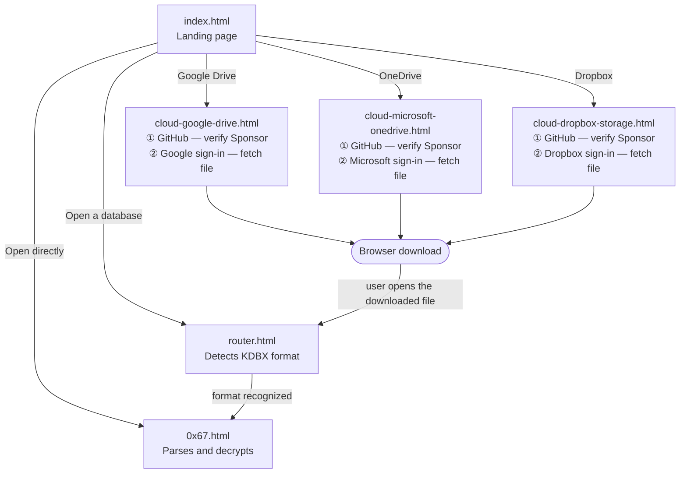

# Pages

This document maps `pages/` — what each page does and how a visitor moves between them.

## Page inventory

| Page | Availability | Description |
|---|---|---|
| `index.html` | GA | Landing page. The entry point; links to every other page. |
| `router.html` | GA — format-detection logic tracked in [issue #1][issue-1] | Detects a database's KDBX format and opens the matching app page. |
| `0x67.html` | GA | The app — parses, decrypts, and edits KDBX 3.1 and 4.x databases. |
| `cloud-google-drive.html` | GA — tracked in [issue #1][issue-1] | Sponsor-gated connector for Google Drive. |
| `cloud-microsoft-onedrive.html` | Future | Sponsor-gated connector for OneDrive, same pattern as Drive. Design only — not yet tracked by an issue. |
| `cloud-dropbox-storage.html` | Future | Sponsor-gated connector for Dropbox, same pattern as Drive. Design only — not yet tracked by an issue. |

Google Drive is part of general release, per [issue #1][issue-1]'s DoD and checklist. The OneDrive and Dropbox connectors are recorded here to capture the design, not as a commitment to ship — neither exists yet, and neither is tracked by an issue the way the GA work is.

## User flow

## Cloud connectors

Each connector page is named `cloud-{vendor}-{brand}.html`, falling back to `storage` as the brand when a vendor has no separately-named product — `cloud-google-drive.html`, `cloud-microsoft-onedrive.html`, `cloud-dropbox-storage.html`.

Every connector performs the same two explicit steps: first, sign in with GitHub to verify Sponsor status; second, sign in with the storage vendor's own OAuth flow and fetch the chosen file. Neither step persists a session or passes a token to another page — every visit to a connector re-authenticates independently, on both counts. This follows directly from the priority order in [AGENTS.md][agents]: it's the smallest surface area (no session store, no cross-page protocol to build or audit) and the most explicit option (every access to a paid feature requires the user to actively authorize it, right there), even though it costs some convenience.

Fetched bytes never move between pages through custom code. A connector triggers a native browser download and stops; the user opens the downloaded file through `router.html`, the same path a local file already takes. This means `router.html` and `0x67.html` never need to know a cloud connector exists, and the KDBX parser is never duplicated into a connector page.

What a storage vendor's own login page offers — a password field, "Continue with Google," "Continue with Apple," whatever else — is invisible to us and requires no special handling on our side. We only ever redirect to that vendor's OAuth authorization endpoint and exchange the authorization code it returns for a token scoped to that vendor. How the vendor resolves the user's identity behind that redirect is entirely its own concern.

[issue-1]: https://github.com/keepass-web/source-application/issues/1
[agents]: ../AGENTS.md
