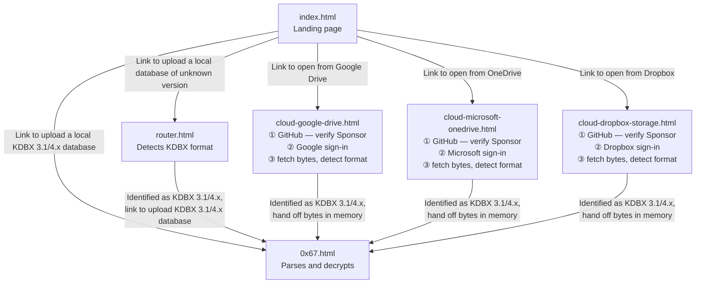

# Pages

This document maps `pages/` — what each page does and how a visitor moves between them.

## Page inventory

| Page | Availability | Description |
|---|---|---|
| `index.html` | GA | Landing page. The entry point; links to every other page. |
| `router.html` | GA | Detects a database's KDBX format and provides a link to the matching app page. |
| `0x67.html` | GA | The app — parses, decrypts, and edits KDBX 3.1 and 4.x databases. |
| `cloud-google-drive.html` | GA | Sponsor-gated connector for Google Drive. |
| `cloud-microsoft-onedrive.html` | Future | Sponsor-gated connector for OneDrive. |
| `cloud-dropbox-storage.html` | Future | Sponsor-gated connector for Dropbox. |

## User flow

## Local storage

Opening a database from local disk needs nothing but the file itself: no account, no sign-in, no network connection. `router.html` and `0x67.html` work completely offline, so a vault on a USB drive or a personal laptop opens the same way whether there's an internet connection or not. Nothing about the file goes anywhere — there's no vendor, no OAuth exchange, and no service to trust beyond the browser itself. This is the free path: no sponsorship needed, open to every visitor.

## Cloud storage providers

Sponsors can open and save a database directly from Google Drive and other cloud storage providers (as demand drives adoption), without ever downloading it to disk. The file's bytes go straight into browser memory, get edited there, and are written straight back to the provider; on-disk storage is never part of the round trip. That's more convenient than the download-edit-reupload cycle a local file requires, and it's more secure. On a computer whose disk can't be accessed, trusted, or written to like a public library terminal, a locked-down kiosk, a borrowed laptop, there's nothing on that disk to worry about, because the vault was never on it.

Cloud storage support is a Sponsor benefit: [GitHub Sponsors][sponsors] funds its development and unlocks it.

[sponsors]: https://github.com/sponsors/keepass-web
