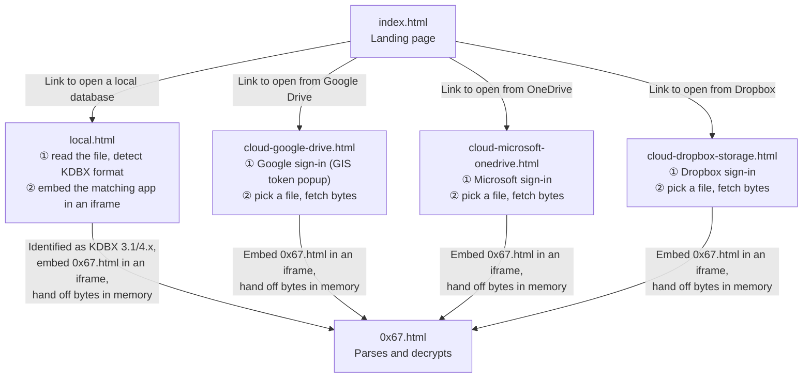

# Pages

This document maps `pages/` — what each page does and how a visitor moves between them.

## Page inventory

| Page | Availability | Description |
|---|---|---|
| `index.html` | GA | Landing page. The entry point; links to every other page. |
| `local.html` | GA | Local-file connector: reads a dropped file, detects its KDBX format, and embeds the matching app page in an iframe — or embeds it straight on a create-database screen instead, for a brand-new file. |
| `0x67.html` | GA | The app — parses, decrypts, creates, and edits KDBX 3.1 and 4.x databases. |
| `cloud-google-drive.html` | GA | Connector for Google Drive. |
| `cloud-microsoft-onedrive.html` | Future | Connector for OneDrive. |
| `cloud-dropbox-storage.html` | Future | Connector for Dropbox. |

## User flow

```mermaid
flowchart TD
    INDEX["index.html<br/>Landing page"]

    INDEX -->|"Link to open a local database"| LOCAL["local.html<br/>① read the file, detect KDBX format<br/>② embed the matching app in an iframe"]
    LOCAL -->|"Identified as KDBX 3.1/4.x,<br/>embed 0x67.html in an iframe,<br/>hand off bytes in memory"| APP["0x67.html<br/>Parses and decrypts"]

    INDEX -->|"Link to open from Google Drive"| DRIVE["cloud-google-drive.html<br/>① Google sign-in (GIS token popup)<br/>② pick a file, fetch bytes"]
    INDEX -->|"Link to open from OneDrive"| ONEDRIVE["cloud-microsoft-onedrive.html<br/>① Microsoft sign-in<br/>② pick a file, fetch bytes"]
    INDEX -->|"Link to open from Dropbox"| DROPBOX["cloud-dropbox-storage.html<br/>① Dropbox sign-in<br/>② pick a file, fetch bytes"]

    DRIVE -->|"Embed 0x67.html in an iframe,<br/>hand off bytes in memory"| APP
    ONEDRIVE -->|"Embed 0x67.html in an iframe,<br/>hand off bytes in memory"| APP
    DROPBOX -->|"Embed 0x67.html in an iframe,<br/>hand off bytes in memory"| APP
```

## How the local-file connector works

`local.html` reads a dropped or chosen file's bytes once, right there in the tab — nothing is uploaded. It identifies the KDBX format from the file's first 8 bytes via the shared `packages/router` package (the same format-detection logic every chooser page uses, so which implementation reads a given format is decided in exactly one place), then embeds the matching implementation (currently only `0x67.html`) in an iframe and hands it the bytes it already read, over the same same-origin message protocol (`packages/embed-protocol`) the cloud connectors use. There is no second file picker: the file is never re-selected on the embedded app's own upload screen, because the app never shows one when opened this way. A file that's recognized but has no implementation yet (KeePass 1.x `.kdb`, a KDBX pre-release) is reported inline instead of embedding anything; a completely unrecognized file gets the same treatment.

"Create a new database" is the other way into the same iframe: with no file to sniff, the connector embeds `0x67.html` straight away and, once it announces readiness, tells it to start a fresh database instead of opening one (`kw-create`, the create-side counterpart to `kw-open` in `packages/embed-protocol`). Naming and creating the database — `Kdbx.create` and everything it depends on — happens exactly where opening one does, inside `0x67.html`; the connector never gains its own copy of that logic, it only decides which of the two messages to send.

On save, since there is nowhere to write back to, the local connector downloads the updated bytes the same way `0x67.html` would if opened standalone — the only piece of this connector that's genuinely local-specific. This applies equally to a freshly created database: its first save is just a download, named for whatever the create screen's own form was given.

## How the Google Drive connector works

`cloud-google-drive.html` never parses or decrypts anything itself. It signs in to Google, then either lets the user pick a `.kdbx` file with the Google Picker and downloads its bytes, or starts a brand-new one (`kw-create`, same as `local.html`) — either way it embeds the real `0x67.html` app in an iframe and hands it whatever it has. All the unlocking, browsing, and editing is the ordinary, unmodified app; the connector only fetches or creates the file and writes it back.

**Sign-in.** The connector loads Google's own [Identity Services][gis-token] library to obtain an access token in the browser via a popup. A popup is used rather than a redirect because a redirect would require keeping state across the navigation, which the no-persistence rule forbids; the cost is that a browser blocking the popup (e.g. a locked-down kiosk) needs popups allowed for this site. File selection then uses the [Google Picker][picker] with the non-sensitive `drive.file` scope, so the app only reaches the files the user picks. These two Google libraries are the connector's only external code, and no state is stored anywhere (see [Trust][trust] / `AGENTS.md`): the master password and all decryption stay in the sandboxed `0x67.html` iframe, which loads nothing external.

**Handoff and save.** The connector and the embedded app exchange same-origin messages: the connector hands the app the file's bytes (or a create instruction, for a new one), and on save the app hands the edited bytes back for the connector to write to Drive. For a database that started as an open, that write is an update to the file already picked; for one that started as a create, the first save instead creates the file — still under the `drive.file` scope, since a file this app just created is exactly what that scope covers — and the connector remembers its id so every later save in the same session updates that same file rather than creating another. New files land in the root of My Drive; there's no folder picker yet. The local-download option is hidden while embedded either way. Opened on its own, `0x67.html` receives no such messages and behaves exactly as it does standalone.

## Opening from local disk

Opening a database from local disk needs nothing but the file itself: no account, no sign-in, no network connection. `local.html` and `0x67.html` work completely offline, so a vault on a USB drive or a personal laptop opens the same way whether there's an internet connection or not. Nothing about the file goes anywhere — there's no vendor, no OAuth exchange, and no service to trust beyond the browser itself. Opening a local file needs no account of any kind and is open to every visitor.

## Cloud storage providers

Anyone can open and save a database directly from Google Drive and other cloud storage providers (as demand drives adoption), without ever downloading it to disk. The file's bytes go straight into browser memory, get edited there, and are written straight back to the provider; on-disk storage is never part of the round trip. That's more convenient than the download-edit-reupload cycle a local file requires, and it's more secure. On a computer whose disk can't be accessed, trusted, or written to like a public library terminal, a locked-down kiosk, a borrowed laptop, there's nothing on that disk to worry about, because the vault was never on it.

The cloud connectors are open to every visitor: there is no sponsorship gate, and opening a cloud vault requires only your own provider's sign-in and the master password — never a GitHub login. KeePass Web provides no storage of its own; it connects to a provider you already have. [GitHub Sponsors][sponsors] is how people who find the connectors valuable can support the people building them. The app invites sponsorship but never requires it.

[sponsors]: https://github.com/sponsors/keepass-web
[picker]: https://developers.google.com/workspace/drive/picker/guides/overview
[gis-token]: https://developers.google.com/identity/oauth2/web/guides/use-token-model
[trust]: ../README.md#trust
