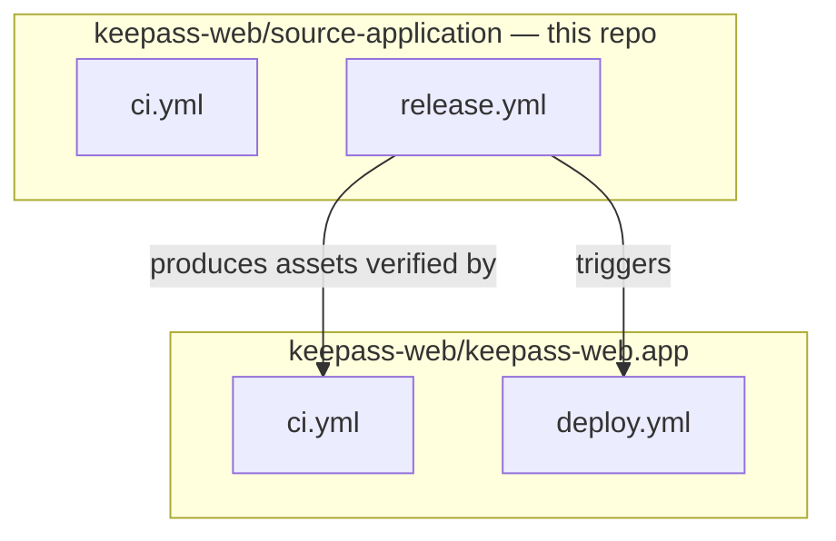
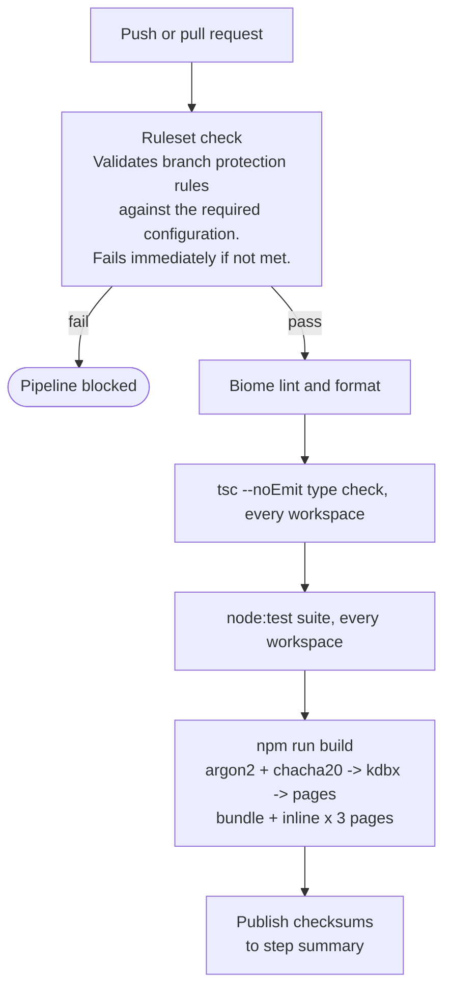
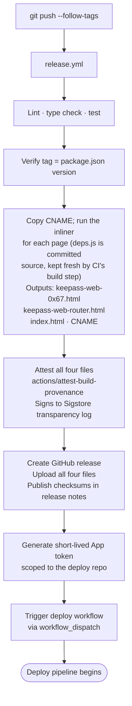
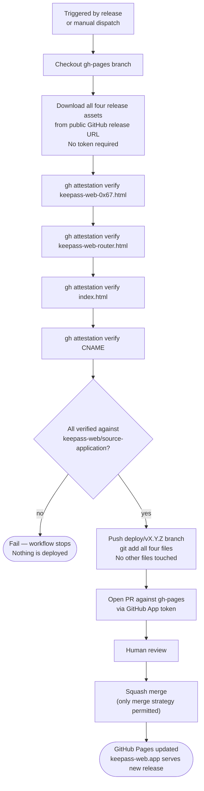
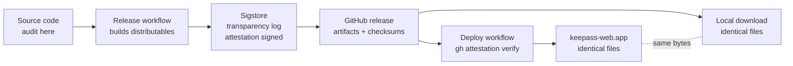

# Pipeline

This document maps the complete build, release, and deploy pipeline. Almost
all of it lives in this repo; the one exception — the deploy step — lives in
a separate repo because it's what owns the GitHub Pages configuration being
deployed to.

---

## Workflow inventory

| Workflow | Location | Type |
|---|---|---|
| CI pipeline | `.github/workflows/ci.yml` | Substantive |
| Release | `.github/workflows/release.yml` | Substantive |
| Deploy | `keepass-web.app/.github/workflows/deploy.yml` | Substantive — separate repo |
| Deploy verification | `keepass-web.app/.github/workflows/ci.yml` | Substantive — separate repo |

The crypto libraries, the KDBX parser, the app, and the build tooling are all
in this repo, so there's one CI configuration to write and run.

### Why the deploy workflow doesn't live here

The deploy workflow downloads release assets, verifies them, and pushes to a
specific GitHub Pages repo's `gh-pages` branch. It has to live in that repo
because that's where the Pages configuration, the `gh-pages` branch
protection, and the deploy-bot's scoped permissions all are. To audit the
complete pipeline, a reader needs this repo and `keepass-web.app`. This
document links each.

---

## Architecture

---

## CI pipeline

Runs on every push and pull request.

---

## Release pipeline

Runs when a `v*` tag is pushed. Defined entirely in
`.github/workflows/release.yml`.

---

## Deploy pipeline

Runs automatically after a release, or manually via Actions → Deploy →
Run workflow. Defined entirely in
`keepass-web.app/.github/workflows/deploy.yml`.

Every file committed to `gh-pages` is a verbatim copy of a release artifact.
Nothing is created or modified during deployment.

### Deploy PR verification

Every PR targeting `gh-pages` runs `keepass-web.app/ci.yml`, which
verifies the distributables before the PR can be merged. Checksum verification
against the published release is [not yet implemented][deploy-ci].

---

## Attestation and the trust chain

A file on keepass-web.app and a file downloaded from the GitHub release are the
same bytes. Trust established by auditing the source and verifying the
attestation transfers to both without qualification.

[deploy-ci]: https://github.com/keepass-web/keepass-web.app/blob/main/.github/workflows/ci.yml
