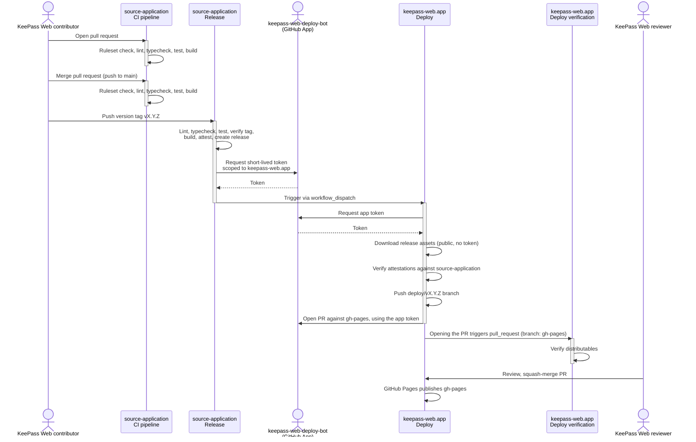
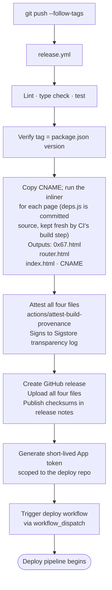
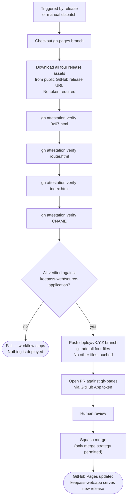

# Pipeline

This document maps the complete build, release, and deploy pipeline.

## Workflow inventory

| Workflow | Location | Description |
|---|---|---|
| CI pipeline | [`source-application/.github/workflows/ci.yml`][ci-workflow] | Lints, type-checks, tests, and builds on every push and pull request in `source-application`. |
| Release | [`source-application/.github/workflows/release.yml`][release-workflow] | Builds, attests, and publishes a GitHub release on every version tag in `source-application`, then triggers deploy. |
| Deploy | [`keepass-web.app/.github/workflows/deploy.yml`][deploy-workflow] | Verifies release attestations and opens a PR in `keepass-web.app` to publish the release to `gh-pages` branch. |
| Deploy verification | [`keepass-web.app/.github/workflows/ci.yml`][deploy-ci] | Verifies distributables on every `keepass-web.app` PR targeting `gh-pages`. |

The crypto libraries, the KDBX parser, the app, and the build tooling are all in this repo, so there's one CI configuration to write and run.

### Why the deploy workflow doesn't live here

The deploy workflow downloads release assets, verifies them, and pushes to a specific GitHub Pages repo's `gh-pages` branch. It has to live in that repo because that's where the Pages configuration, the `gh-pages` branch protection, and the deploy-bot's scoped permissions all are. To audit the complete pipeline, a reader needs this repo and `keepass-web.app`. This document links each.

## Architecture

Who does what, and which workflow it triggers:

A version-tag push is a separate, deliberate action from merging a regular pull request — merging only re-runs CI on `main`; nothing deploys until someone pushes a tag.

## CI pipeline

Runs on every push and pull request.

## Release pipeline

Runs when a `v*` tag is pushed. Defined entirely in `.github/workflows/release.yml`.

## Deploy pipeline

Runs automatically after a release, or manually via Actions → Deploy → Run workflow. Defined entirely in `keepass-web.app/.github/workflows/deploy.yml`.

Every file committed to `gh-pages` is a verbatim copy of a release artifact. Nothing is created or modified during deployment.

### Deploy PR verification

Every PR targeting `gh-pages` runs `keepass-web.app/ci.yml`, which verifies the distributables before the PR can be merged. Checksum verification against the published release is [not yet implemented][deploy-ci]. For how the resulting artifacts are verified end to end, see [Verifying a release independently][releases-verify].

[ci-workflow]: https://github.com/keepass-web/source-application/blob/main/.github/workflows/ci.yml
[release-workflow]: https://github.com/keepass-web/source-application/blob/main/.github/workflows/release.yml
[deploy-workflow]: https://github.com/keepass-web/keepass-web.app/blob/main/.github/workflows/deploy.yml
[deploy-ci]: https://github.com/keepass-web/keepass-web.app/blob/main/.github/workflows/ci.yml
[releases-verify]: RELEASES.md#verifying-a-release-independently
