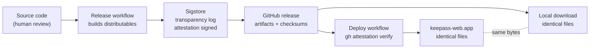

# Releases

## What a release produces

| File | Purpose |
|------|---------|
| `index.html` | Landing page |
| `router.html` | Identifies a database's KDBX format and links to the right app version |
| `0x67.html` | The app itself, for KDBX 3.1 and 4.x database support |
| `CNAME` | The custom domain GitHub Pages serves the deploy from |

Every file served from [keepass-web.app][app] is a verbatim copy of a file published in a GitHub release — nothing is created, modified, or synthesized during deployment. A copy downloaded from Releases and a copy served from the hosted site are the same bytes; see [Reproducing a build][reproducing] to verify that yourself.

## Overview

```
git push --follow-tags
  └─ source-application: Release workflow
       ├─ lint / typecheck / test
       ├─ build distributables
       ├─ attest with SLSA provenance
       ├─ create GitHub release
       └─ trigger Deploy workflow
            └─ keepass-web.app: Deploy workflow
                 ├─ download release assets
                 ├─ verify attestations
                 ├─ push deploy/vX.Y.Z branch
                 └─ open PR → human reviews → squash merge
                      └─ GitHub Pages updated
```

Deploy is the one step that lives in a separate repository (`keepass-web.app`) — that repo's GitHub Pages configuration and its `gh-pages` branch protection are what's being deployed to, so it stays as the deploy target rather than folding into this repo.

## Cutting a release

From `main`:

```sh
npm version patch   # or minor / major
git push --follow-tags
```

`npm version` updates `package.json`, commits the change, and creates a tag. Pushing the tag triggers the Release workflow.

## The Release workflow

`.github/workflows/release.yml` runs on every `v*` tag push:

1. Checks out source
2. Installs dependencies (`npm ci` — every hash verified against `package-lock.json`)
3. Runs lint, type checking, and tests
4. Guards that the tag matches the `package.json` version
5. Copies `CNAME` and runs the inliner for each page. This does *not* re-run the bundler — `pages/0x67/deps.js` is committed source, kept current by the CI pipeline's `npm run build` step on every push and pull request, not regenerated at release time
6. Attests each using `actions/attest-build-provenance`, writing a signed SLSA provenance record to the Sigstore transparency log
7. Creates the GitHub release and uploads all distributables
8. Generates a short-lived App token scoped to the deploy repo and triggers its Deploy workflow

## The Deploy workflow

`keepass-web.app/.github/workflows/deploy.yml` runs automatically after a release, or can be triggered manually (Actions → Deploy → Run workflow → enter release tag):

1. Checks out `gh-pages`
2. Downloads the release assets (over public Internet)
3. Verifies attestations: `gh attestation verify` queries the Sigstore transparency log to confirm each file was produced by this repo's Release workflow; fails immediately if not
4. Pushes a `deploy/vX.Y.Z` branch
5. Opens a PR against `gh-pages` using a GitHub App token

## Human review

The PR is the deployment gate. Review it, then squash merge. Only squash merging is permitted on the deploy repo. GitHub Pages updates automatically after the merge.

## The GitHub App

`keepass-web-deploy-bot` provides the cross-repo automation. It holds two permissions on the deploy repo:

- `contents: write` — push the deploy branch
- `pull_requests: write` — open the PR

Its credentials are stored as organisation secrets (`DEPLOY_BOT_APP_ID`, `DEPLOY_BOT_APP_PRIVATE_KEY`), scoped only to the repos that need them. A short-lived installation token is generated at workflow runtime; no long-lived credential persists in the workflow environment.

## Verifying a release independently

Any party can verify that a published distributable was produced by the Release workflow:

```sh
gh attestation verify <file> --repo keepass-web/source-application
```

This queries the Sigstore transparency log and confirms the attestation signature matches a run of this repo's Release workflow. A file not produced by that workflow cannot be verified.

Everything from the build onward is mechanical and independently checkable — the one link in this chain that's a matter of human trust rather than cryptographic proof is the source code itself:



A file on keepass-web.app and a file downloaded from the GitHub release are the same bytes. Trust established by auditing the source transfers to both without qualification, because every step after that is verified by attestation rather than taken on faith.

[app]: https://keepass-web.app/
[reproducing]: REPRODUCING.md
